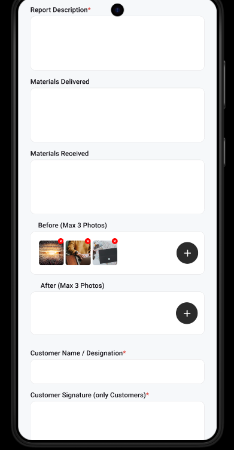
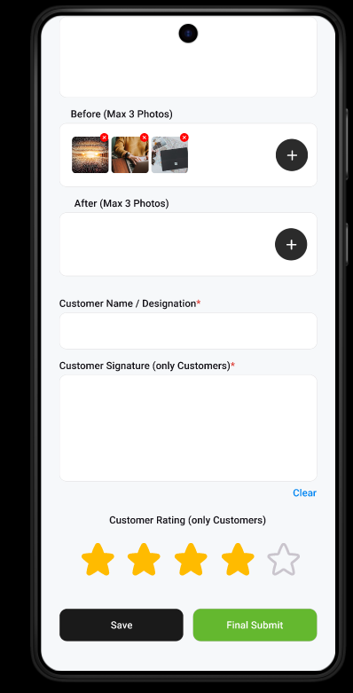
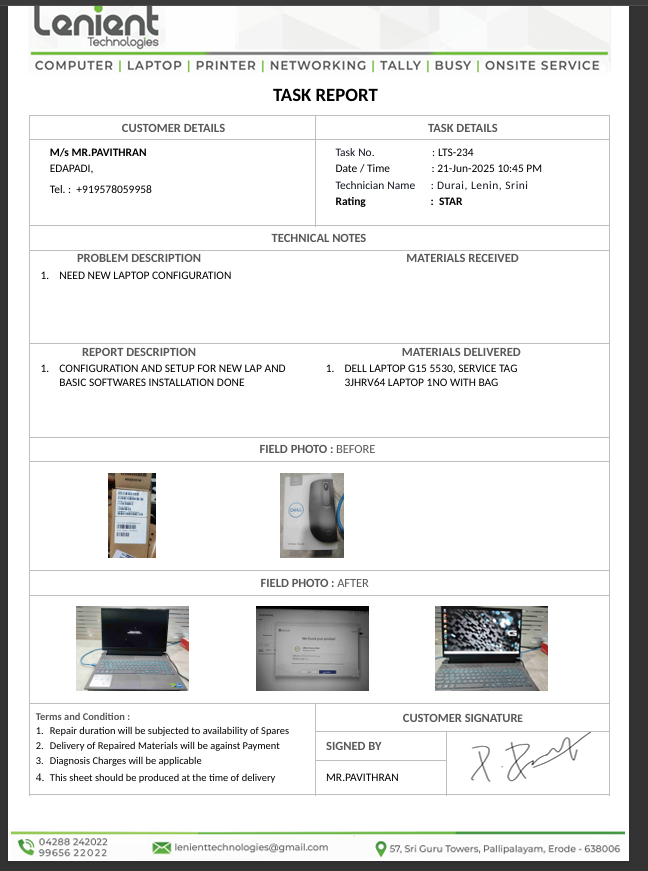

# Lenient Technologies


A modern, pixel-perfect Flutter application for seamless form management, PDF generation, and document handling. Built with Material 3, custom fonts, and a beautiful, responsive UI to match real-world business needs. 

---

## 🖼️ App Logo

<p align="center">
  
</p>

---

## 🚀 Features

- ✨ Pixel-perfect, responsive UI (Material 3)
- 📝 Advanced form creation & management
- 🖊️ Signature capture and star rating
- 📅 Date/time picker, dropdowns, and validation
- 📷 Photo grid (add/remove images from camera or gallery)
- 📄 PDF generation with custom template
- 👁️ PDF preview, download (to Downloads/Lenient), and sharing
- ⬇️ Download and manage documents
- 🎨 Custom themes, icons, and branding
- 🔄 Cross-platform: Android, iOS
- ⚡ Internal APK distribution

---

## 📸 Screenshots

<p align="center">
  
  
  
  
  
</p>

---

## 🛠️ Getting Started

To run this project locally:

1. **Clone the repository:**
   ```bash
   git clone https://github.com/karthi-AI-hub/lenient.git
   cd lenient
   ```
2. **Install dependencies:**
   ```bash
   flutter pub get
   ```
3. **Run the app:**
   ```bash
   flutter run
   ```
4. **Build APK for internal distribution:**
   ```bash
   flutter build apk --release
   # Share the APK file in build/app/outputs/flutter-apk/app-release.apk
   ```

---

## 📁 Folder Structure

```
lenient_technologies/
  ├── android/           # Android native code
  ├── assets/            # Images, icons, fonts, templates
  ├── ios/               # iOS native code
  ├── lib/               # Main Dart codebase
  │   ├── models/        # Data models
  │   ├── screens/       # App screens (Home, Forms, Download, Entry, PDF Preview)
  │   ├── theme/         # App theming
  │   ├── utils/         # Utilities (PDF generator, dialogs, snackbars)
  │   └── widgets/       # Reusable widgets (AppBar, NavBar)
  ├── test/              # Unit and widget tests
  └── web/               # Web support files
```

---

## 📦 Dependencies

- [Flutter](https://flutter.dev/) 3.8+
- [path_provider](https://pub.dev/packages/path_provider)
- [uuid](https://pub.dev/packages/uuid)
- [flutter_svg](https://pub.dev/packages/flutter_svg)
- [pdf](https://pub.dev/packages/pdf)
- [printing](https://pub.dev/packages/printing)
- [image_picker](https://pub.dev/packages/image_picker)

---

## 🔒 Permissions

- Camera: For taking photos
- Storage: For saving PDFs to Downloads/Lenient (Android)
- Internet: For any network features
- All permissions are handled by plugins; no manual permission code required for image picking or PDF saving.

---

## 🤝 Contributing

Contributions are welcome! Please open issues and submit pull requests for improvements or bug fixes.

---

## 📄 License

This project is licensed under the MIT License. See the [LICENSE](LICENSE) file for details.
